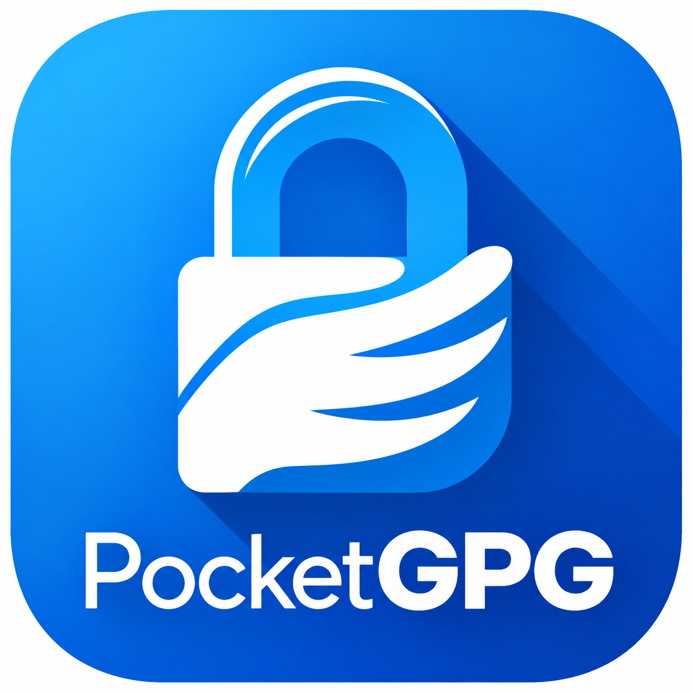

# PocketGPG

Encrypt and decrypt files with a passphrase on Android, producing ordinary OpenPGP
`.gpg` files that open anywhere with `gpg -d`.

<p align="center">
  
</p>

## What it does

- **Encrypt any files** with a passphrase you choose or generate. Output is a standard
  OpenPGP message: binary `.gpg`, or ASCII-armoured `.asc` if you want something you can
  paste into a message.
- **Bundle multiple files** into a single `.zip` first, if you'd rather send one file than
  many. The zip is streamed straight into the encrypted output, so the combined plaintext
  never touches storage. Decrypting gives you the `.zip` back to open yourself.
- **Decrypt** anything produced by PocketGPG or by `gpg --symmetric`.
- **Pick the cipher**: AES-256 (default), AES-192, AES-128, Camellia, Twofish, and the
  legacy Blowfish/3DES for compatibility. Compression is ZLIB, ZIP, BZip2 or none.
- **Shred the originals** after a successful run, overwriting the contents before deleting
  rather than doing a plain delete. The app is explicit about the limits of this on flash storage.
- Results land in a folder you pick, so they're reachable over USB or from any file
  manager, and there's a Share button for handing one to another app.

## Symmetric, not key-based

PocketGPG does what `gpg --symmetric` does: one passphrase locks the file and the same
passphrase unlocks it. There are no public/private keys and no keyring to manage. Whoever
you send the file to just needs the passphrase, and how you get it to them is up to you.

## Is this "real" GPG?

The file format is: PocketGPG writes standard OpenPGP (RFC 4880) messages that GnuPG reads
without complaint, and reads GnuPG's `--symmetric` output in return. The test suite proves
this in both directions against whichever `gpg` binary is on the build machine.

The engine is [Bouncy Castle's OpenPGP implementation](https://www.bouncycastle.org)
(`bcpg`), not a cross-compiled GnuPG binary. It is the same library OpenKeychain uses. Key
derivation is salted-and-iterated SHA-256 at the maximum iteration count the format can
encode (65,011,712, matching `gpg --s2k-count 65011712`), and every message carries a
modification-detection code.

Verify it yourself:

```console
$ gpg --list-packets secret.txt.gpg
:symkey enc packet: version 4, cipher 9, aead 0, s2k 3, hash 8
        salt 2E8774FD9E6A0D6D, count 65011712 (255)
:encrypted data packet:
        mdc_method: 2
```

## Privacy

The app holds **no `INTERNET` permission**, so it cannot open a network connection at all.
Android enforces that at the OS level. Share hands a file to whichever app you pick, and
that app does the sending under its own permissions. Full policy: <https://mcm190.github.io/pocketgpg-privacy/>, mirrored here in
[`docs/index.html`](docs/index.html).

## Building

Requires JDK 17+ and the Android SDK.

```bash
./gradlew :app:assembleDebug        # build
./gradlew :app:testDebugUnitTest    # crypto tests, incl. GnuPG interop if gpg is installed
```

The interop tests skip themselves when `gpg` is unavailable, and skip individual ciphers
that a given distribution has compiled out.

## Layout

| Path | What's in it |
| --- | --- |
| `crypto/PgpCrypto.kt` | OpenPGP encrypt/decrypt. No Android imports, so it unit-tests on the JVM. |
| `crypto/PgpOptions.kt` | Cipher and compression choices, S2K parameters. |
| `crypto/Shredder.kt` | Overwrite-rename-delete of a document. |
| `data/Documents.kt` | Storage Access Framework plumbing and output naming. |
| `MainViewModel.kt` | Job orchestration, zip bundling, progress and cancellation. |
| `ui/` | Compose UI. |

## Licence

MIT, see [LICENSE](LICENSE).

PocketGPG bundles Bouncy Castle (Bouncy Castle Licence, MIT-style) and AndroidX, Jetpack
Compose and the Kotlin libraries (Apache-2.0). Both are permissive and neither is copyleft.
Full attribution is in [THIRD-PARTY-NOTICES.md](THIRD-PARTY-NOTICES.md) and in the app's
About screen. GnuPG is not bundled; it is only referenced because the app writes the same
format, and because the test suite shells out to it to prove interoperability.
